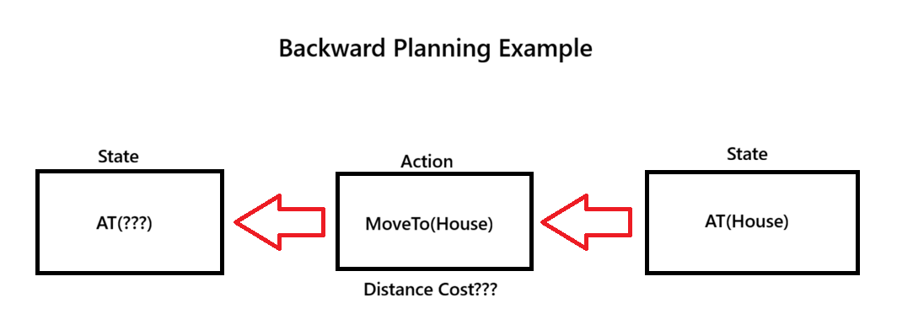
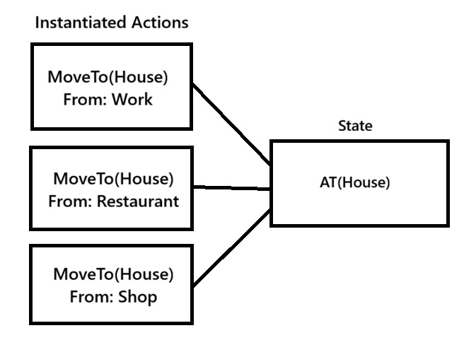
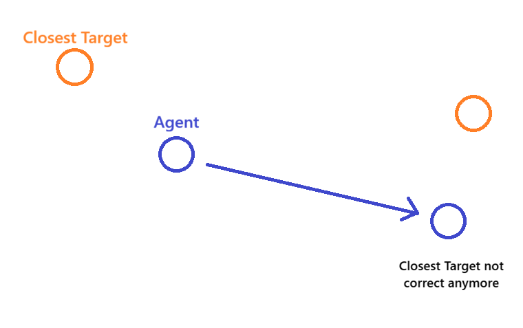

# The Challenges of Implementing Distance-based Costs for GOAP
This blog explores the main challenges and solutions I encountered while implementing distance-based costs during an eight-week school project where I focused on learning and implementing a GOAP system. It assumes that the reader has some experience with GOAP and graph search algorithms.

<video width="640" height="480" controls>
  <source src="/assets/demo_example.mp4" type="video/mp4">
</video>

In the demo the agent alternates between the shooting and the white circle where it can pick up more ammo. The distances that the agent needs to move are added to the cost of the actions. The planner eventually decides to move into melee range because the combined cost of moving, picking up ammo and shooting became higher than simply moving into melee range for a melee attack.

## Why are distance-based costs relevant? 
The planner selects actions based on their assigned costs. With multiple actions that can satisfy the current state the planner will naturally pick the action with the lowest cost.
However what will happen when these costs do not take distances into account? An action might appear cheap in the planner but is far away from the agent. Whereas a more expensive action might be much closer to the agent.

During plan/action execution the agent may travel a very long distance to be able to execute the action that was initially considered cheap, resulting in less believable or tactical behaviour.

For example, an agent might decide to run across the entire map to pick up ammo and then shoot the player rather than going for a melee strike even when the player is quite close. The planner thinks that picking up ammo and shooting the player was cheaper, but from a spatial perspective a melee strike would have been a better or a more believable choice.

Furthermore, as noted by Chris Conway in his GDC 2017 presentation “GOAP in Tomb Raider, situational costs can be used to create complex (multi-action) methods for solving the same requirement(s). The following example is taken directly from his slides:
-	GoTo(cost = 20, for 20m) + MeleeAttack(cost = 1) = Plan cost of 21
-	TakeOff(cost = 1) + FlyTo(cost = 4, for 20m) + Land(cost = 1) + MeleeAttack (cost=1) = Plan cost of 7 

## The main problem
My initial goal was to keep the search space as small as possible and prevent the planner from doing any unnecessary extra work. In an ideal scenario the planner knows the location of the agent and the location of where its trying to go beforehand. However, when specifically dealing with **spatial information during planning** I started running into a problem that can be summed up with these two sentences:

**Forward Planning (Start -> Goal)**: I know where I am, but not where I want to go.

**Backward Planning (Goal -> Start)**: I know where I want to go, but not where I was before



The example above shows the planner instantiating a MoveTo(X) action because its effect can satisfy the AT(House).  The planner knows that it is moving to the house and can therefore find a position. However, the planner does not yet know the agent’s current location, since that information relies on future actions in the search.

So the question is how do we resolve or work around this issue? 

## Potential solutions
There are a couple of different solutions that I managed to find or think of each with their own set of trade-offs. 

### Preconditions
The first option would simply be adding more hard limits/pre-conditions like InMeleeRange, InShortRange, InLongRange, Near(Target x), Far(Target x) etc. that give a more general distance indication. Conditions like these and tweaking base action costs could give you potentially better results. However, this does mean that outside of the planner you need to keep constantly track if entities are far or close.


### Instantiating all options
Another option would be instantiating actions for every entity in a certain radius around the agent. While you can limit action creation to only entities that fit for that specific action the search space will increase drastically and the planner is spending time to instantiate. This makes it not ideal option since we preferably want to keep the search space small and the planning time short.



### Actions contain a target
Lastly I found online a unity tool by CrashKonijn that takes a different approach where each action is performed at a position. Actions contain a target position which is used to calculate distance costs between actions. Since actions contain target positions there is no need for movement related actions (can all be done outside of the planner) decreasing the search space.

This is the approach I ended up using for my own GOAP implementation where I used **forward planning** otherwise you would run into the problem again: I know where I want to go, but not where I was before. 

```cpp
struct Action
{
std::string m_name;
	float m_baseCost = 1.0f;
	glm::vec3 m_targetPos = glm::vec3(0);
	float m_targetRadius = 1.0f;

	std::unordered_map<int, bool> m_preconditions;
	std::unordered_map<int, bool> m_effects;
 
    bool AreConditionsMet(const State& state) const;
    State ApplyEffects(const State& state) const;
}
```

The A* search can use the ```agentPos``` in the state and check the distance with the ```targetPos``` from the action. The radius is subtracted from the distance but it is important to clamp the value so we do not end up with a negative number that would impact the search by making the G Cost cheaper than intended. 

```cpp
for (GOAP::Action& action : possibleActions)
{
    if(!action.AreConditionsMet(item.state)) continue;
    GOAP::State outcome = action.ApplyEffects(item.state);

    if (closedList.find(outcome) != closedList.end()) continue;
    const auto distanceCost = glm::length(action.m_targetPos - item.state.m_agentPos) -  action.m_targetRadius;
    const auto clampDistCost = std::max(0.0f, distanceCost);
    float gNew = item.g + action.m_baseCost + clampDistCost;
    outcome.m_agentPos = action.m_targetPos;
           
    const auto& predecessor = bestStateData.find(outcome);
    if (predecessor == bestStateData.end() || gNew < predecessor->second.pathCost)
    {
        bestStateData[outcome] = { item.state, &action, gNew };
        openList.push(OpenListItem(outcome, gNew, (float)outcome.DifferencesFrom(goal)));
    }
}
```

During planning, the agent’s position ```agentPos``` in the state is updated with the action’s ```targetPos``` because after an action we assume that the agent has moved to that. This allows distance costs between actions as described earlier.

It is important to note that the search space does not increase from the agent’s position ```agentPos``` in the state. During planning ```agentPos``` only takes values that correspond to action targets ```targetPos```. Aside from the initial state, it cannot contain unique values thus preventing state explosion.

However, there are some downsides and considerations to this approach as well. This system requires selecting a target for each action before planning, which has a couple consequences. 
First, the closest targets are gathered based on the agent’s current position. However, this changes during planning, meaning that the closest entities before planning may no longer be the closest after the first action as shown in figure3. This can be solved by gathering the closest entities again during planning but that would increase the planner workload. Another option is to accept that the plan is not fully optimal re-plan after a single action is executed. 



The second consequence is that replanning is needed more often. Because the plan was built around a specific target position any changes to that target forces a replan. If there are a lot of entities in the world that are changed, removed, occupied this will lead to a lot of replanning making this solution scale not that well with highly dynamic environments. 

## Conclusion
While the solution I chose helped achieve my initial goal of keeping the search space small and reducing unnecessary planner work, it might end up being less efficient in reality depending on the type of game. I believe there are still alternative or potentially better solutions than the ones discussed here. However, I hope that this blog provided insight to some of the problems and solutions you may encounter when implementing distance-based costs in GOAP.

In the future, I plan to implement a more general GOAP system based on Jeff Orkin’s work and revisit this topic to potentially find more solutions.

## References
GDC Festival of Gaming. (2017, October 9). Goal-Oriented Action Planning: Ten Years of AI Programming [Video]. YouTube. https://www.youtube.com/watch?v=gm7K68663rA

Crashkonijn. (n.d.).  FAQ | GOAP. GOAP. https://goap.crashkonijn.com/readme/faq

Crashkonijn. (n.d.). GitHub - crashkonijn/GOAP: A multi-threaded GOAP system for Unity [Source Code]. GitHub. https://github.com/crashkonijn/GOAP

Orkin, J. & Monolith Productions, Inc. (n.d.). Symbolic Representation of Game World State: Toward Real-Time Planning in Games. In Monolith Productions, Inc. https://cdn.aaai.org/Workshops/2004/WS-04-04/WS04-04-006.pdf

Orkin, J., Monolith Productions, & M.I.T. Media Lab, Cognitive Machines Group. (n.d.). Three states and a plan: the A.I. of F.E.A.R. In Game Developers Conference 2006. https://www.gamedevs.org/uploads/three-states-plan-ai-of-fear.pdf

Redd, D. (2020, May 31). How do I incorporate variables in GOAP when planning regressively from the goal? Stack Overflow. https://stackoverflow.com/questions/62119125/how-do-i-incorporate-variables-in-goap-when-planning-regressively-from-the-goal

